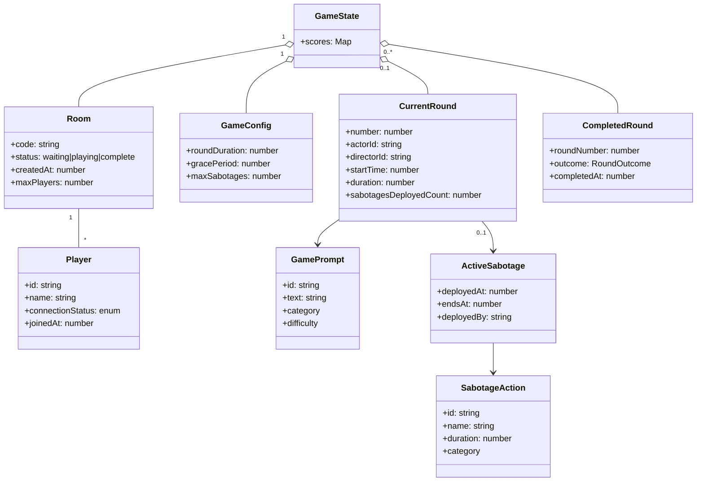
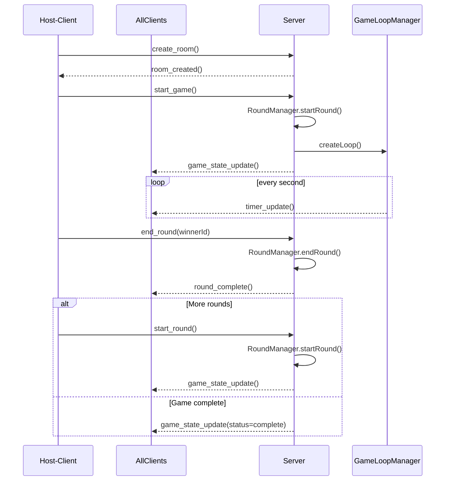
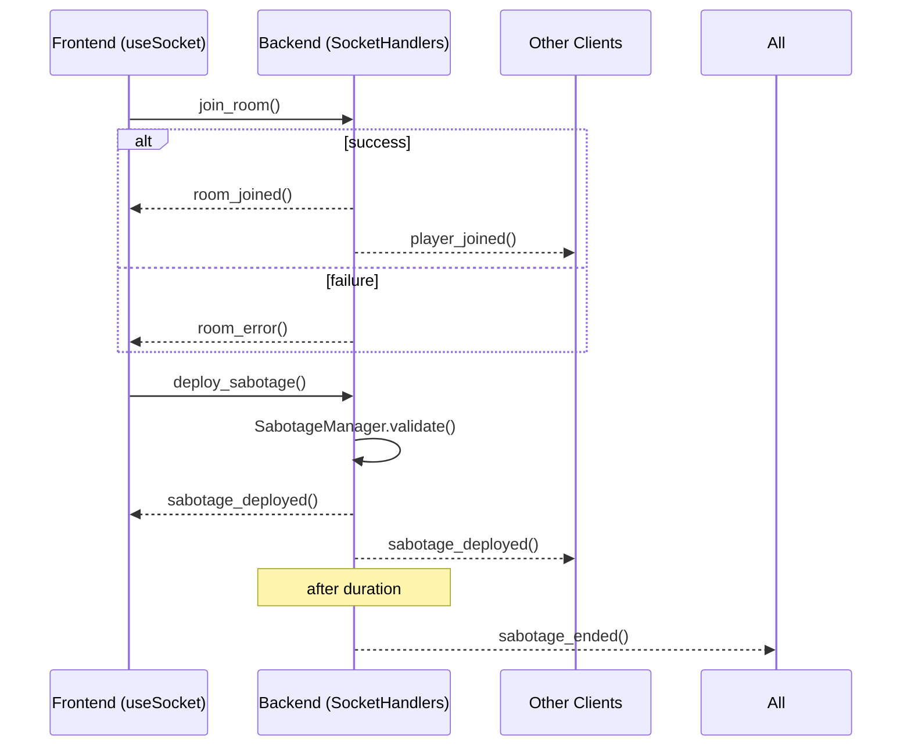
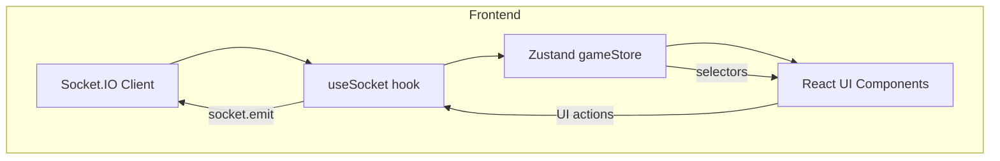

# AI Charades: Director's Cut – Architecture Diagrams

Below are the core UML-style diagrams that give newcomers a fast, visual overview of the system. Each is written in Mermaid so it renders automatically in GitHub / modern Markdown viewers.

---

## 1. Domain Model (Class Diagram)

---

## 2. Room & Round Lifecycle (Sequence Diagram)

---

## 3. Real-Time Socket Event Flow (Sequence Diagram)

---

## 4. Front-End State Synchronisation Pipeline (Component Diagram)

